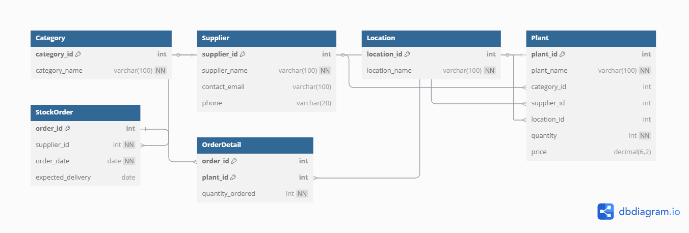

# 🌿 Gardening Inventory Management System (MySQL)

This project is a **relational database system** designed using **MySQL** to manage the inventory of a gardening business. It covers essential components like tracking plants, their categories, stock levels, suppliers, storage locations, and restock orders.

---

## 📌 Objective

To design and implement a **complete database management system** for a real-world scenario.

---

## 📋 Features

- 📦 Track various types of plants and flowers
- 🏷 Categorize plants (Annual, Herb, Perennial, etc.)
- 📍 Store location info (greenhouse, nursery beds, etc.)
- 🔁 Manage supplier details and contact info
- 📑 Track restock orders and their delivery dates
- 🔗 Many-to-Many support between plants and restock orders

---

## 🛠 Technologies Used

- **Database:** MySQL  
- **Tools:** MySQL Workbench  
- **File Format:** `.sql` script file

---

## 🧱 Database Schema Overview

### 🔹 Tables

- `Category` – Defines the type of plant (e.g., Herb, Annual)
- `Supplier` – Information about plant/material suppliers
- `Location` – Where the plant is physically stored
- `Plant` – Main inventory table
- `StockOrder` – Tracks restocking orders
- `OrderDetail` – Maps orders to the plants ordered (Many-to-Many)

---

## 🔐 Constraints & Relationships

- All tables have `PRIMARY KEY` constraints
- `FOREIGN KEY` constraints enforce referential integrity
- `UNIQUE` and `NOT NULL` constraints applied where appropriate
- Uses `1:M` and `M:M` relationships

---

## ⚙️ How to Set Up or Run the Project

1. **Clone or download** this repository:
2. Open your MySQL client (e.g. MySQL Workbench)
3. Run the SQL script to create all tables -
 SOURCE gardening-inventory.sql;

## 🗺 ERD Diagram

Here is the Entity-Relationship Diagram (ERD) for this project:

